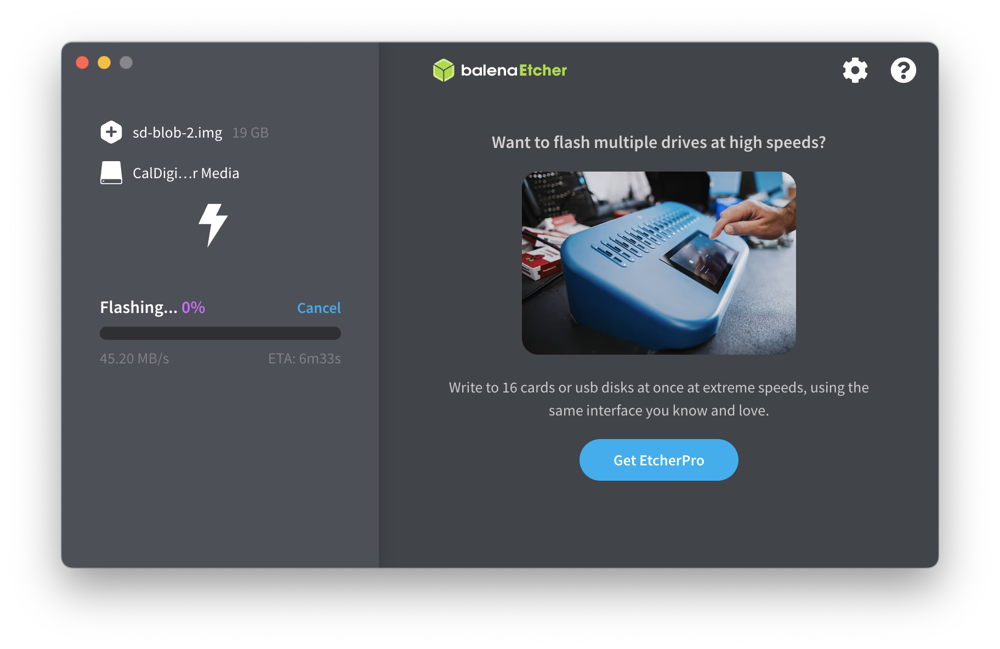

Jetson Orin Nano는 NVIDIA에서 개발한 EdgeAI 개발을 위한 단일 보드 컴퓨터(이하 SBC)입니다.

전체적인 기능은 Raspberry PI와 비슷한데 가장 큰 차이점은 CUDA와 cuDNN을 사용할 수 있습니다.

이것을 사용하려면 Jetpack이라는 것을 설치해야하는데 [엔비디아 튜토리얼](https://developer.nvidia.com/embedded/learn/get-started-jetson-orin-nano-devkit)을 보면서 설치할 수 있습니다.

튜토리얼에는 Jetpack 6.0을 설치하는 과정이 나오는데, 이 과정은 [펌웨어 업데이트](https://developer.nvidia.com/embedded/learn/get-started-jetson-orin-nano-devkit#firmware)가 완료된 보드에서만 가능합니다.

따라서 이 글에서는 펌웨어를 업데이트하고 JetPack 6.0을 설치하는 방법을 공유하려 합니다.

***

## 1. 준비물

1. Jetson orin nano developer kit
2. AC 3구 전원 케이블(부속품에 한국형 커넥터 케이블이 없음)
3. Micro SD 카드(64GB 이상)
4. Display Port 케이블 or DP to HDMI 케이블
5. 키보드, 마우스, 모니터

***

## 2. Jetson UEFI 펌웨어 버전 확인

JetPack 6.0은 36.0버전 이상에서 사용 가능합니다.

UEFI 펌웨어 버전을 확인하는 방법은 다음과 같습니다.

1. Jetson orin에 모니터와 키보드 연결
2. 전원케이블 연결
3. 부팅화면(NVIDIA 로고)이 나올 때 까지 ESC 연타
4. UEFI 설정화면에서 펌웨어 버전 확인

<div>


</div>

펌웨어 버전을 확인했을 때 36.x 로 표시되면 펌웨어 업데이트 과정은 [생략](#4-jetpack-60-설치)해도 됩니다.

<br/>

***

## 3. 펌웨어 업데이트

펌웨어를 업데이트 하려면 이전 버전의 JetPack을 설치한 후 펌웨어 업데이트를 진행해야 합니다.

### 3.1 JetPack 5.1.3 설치

먼저 JetPack 5.1.3 이미지를 [다운로드](https://developer.nvidia.com/embedded/jetpack-sdk-513) 합니다.

<br/>


<br/>

이미지를 SD 카드로 플래시하기 위해 [Balena Etcher](https://etcher.balena.io)를 설치합니다.

다운로드 할 때 컴퓨터 OS에 맞는 설치 파일을 다운로드 해야합니다.


설치가 완료되면  Etcher을 실행시켜 SD카드에 이미지를 플래시 합니다.


용량이 큰 SD 카드에 이미지를 플래시 하면 아래와 같은 경고가 발생하는데 Yes, I'm sure을 누릅니다.




이미지 플래시가 완료되면 아래와 같은 창이 나옵니다.


SD카드를 제거하고 Jetson Orin Nano에 삽입하고 키보드와 마우스를 연결한 후 전원을 연결합니다.

<br/>


<br/>

부팅 후 화면이 5분 이상 들어오지 않는다면 전원을 뽑았다가 다시 연결하면 정상적으로 부팅이 진행하게 됩니다.

부팅이 완료되면 아래와 같은 화면이 나오는데 여기서 세팅을 쭉 진행하시면 됩니다.

펌웨어 업데이트 후 이 OS는 사용하지 않으므로 대충 진행하셔도 됩니다.

<br/>


<br/>

세팅이 완료되면 재부팅 후 JetPack 설치가 완료됩니다.

<br/>


<br/>
<br/>

### 3.2 펌웨어 업데이트

먼저 Jetson에서 터미널을 열고 아래 명령어를 입력하면 펌웨어 버전 정보를 확인합니다.

```
sudo nvbootctrl dump-slots-info
```
아래와 같이 Current version이 35.5.0으로 출력되야합니다.


터미널에서 아래 명령어를 사용하여 QSPI 업데이터를 설치합니다


```
sudo apt-get update
sudo apt-get install nvidia-l4t-jetson-orin-nano-qspi-updater
```


설치가 완료되면 아래와 같은 창이 뜹니다.


아래 명령어로 재부팅 합니다.

```
sudo reboot
```

재부팅된 후 부팅 과정에서 업데이트가 진행됩니다.

<br/>


<br/>

업데이트 이후에 JetPack 6.0이 플래시된 SD카드를 삽입하지 않으면 부팅 시도후 화면이 켜지지 않습니다.

만약 업데이트 후 정상적으로 부팅이 완료된다면 아래 명령어를 사용하여 QSPI 업데이터를 재설치합니다.

```
sudo apt-get update
sudo apt-get --reinstall install nvidia-l4t-jetson-orin-nano-qspi-updater
```

재설치 후 재부팅하면 36.X 버전의 펌웨어로 업데이트 된 후 부팅창 이후에 화면이 꺼집니다.

## 4. JetPack 6.0 설치

먼저 JetPack 5.1.3 이미지를 [다운로드](https://developer.nvidia.com/embedded/jetpack-sdk-60) 합니다.


이미지를 SD 카드로 플래시하기 위해 [Balena Etcher](https://etcher.balena.io)를 설치합니다.

위 3번 파트를 진행했다면 Etcher 설치는 건너 뛰어도 됩니다.

다운로드 할 때 컴퓨터 OS에 맞는 설치 파일을 다운로드 해야합니다.


설치가 완료되면  [3번 과정](#31-jetpack-513-설치)과 동일하게 Etcher을 실행시켜 SD카드에 이미지를 플래시 합니다.


이미지 플래시가 완료되면 SD카드를 제거합니다

그다음 Jetson Orin Nano에 삽입하고 키보드와 마우스를 연결한 후 전원을 연결합니다.

<br/>


<br/>

부팅이 진행된 후 JetPack 초기 설정을 완료하면 JetPack 설치는 완료됩니다.

<br/>

***

<br/>
<br/>

> 다음 글